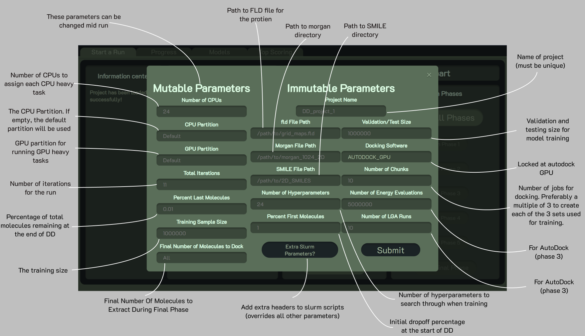
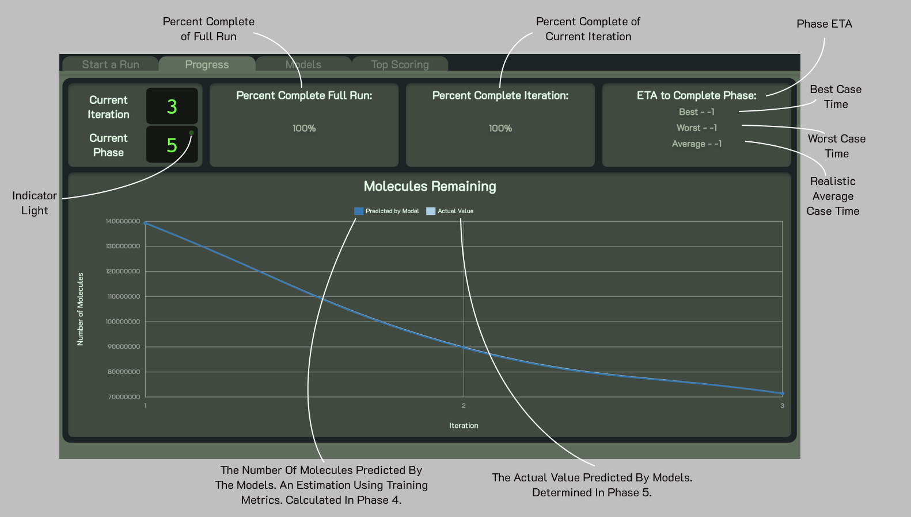
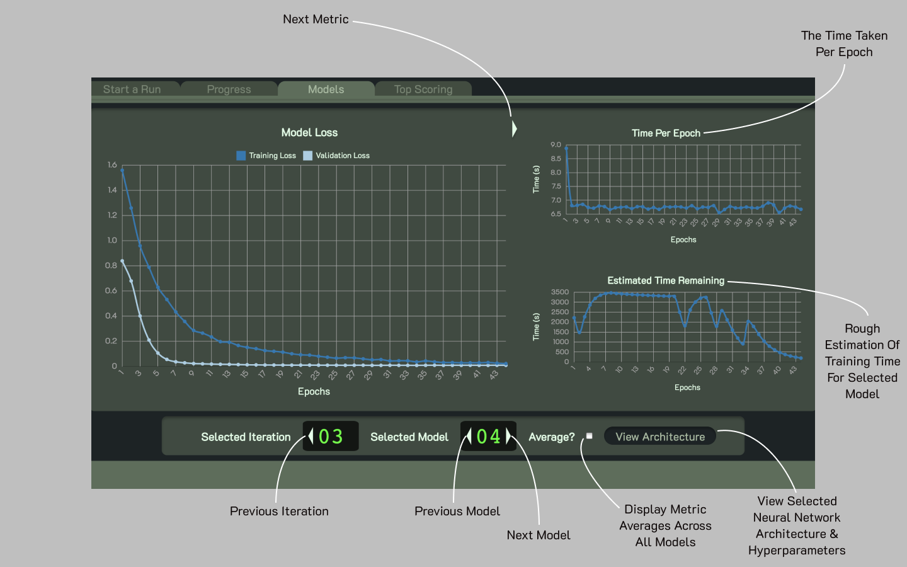

# DeepDockingGUI - v2.5.12


## What is Deep Docking?
Deep docking (DD) is a deep learning-based tool developed to accelerate docking-based virtual screening. For further details into the processes behind DD, please refer to our paper (https://doi.org/10.1021/acscentsci.0c00229). This repository provides a user-friendly, [open-source GUI](https://academic.oup.com/bioinformatics/article-abstract/38/4/1146/6426076) version based on Autodock-GPU docking that allows to run and analyze DD campaigns on a SLURM cluster. If you use this GUI, please cite

Yaacoub, J.C. et al. DD-GUI: a graphical user interface for deep learning-accelerated virtual screening of large chemical libraries (Deep Docking). Bioinformatics 38, 1146–1148 (2022)

## Prerequisites
#### Remote Computer (cloud, cluster, ...):
* SLURM workload manager installed.
* Autodock GPU installed (recommended version: https://github.com/scottlegrand/AutoDock-GPU/tree/relicensing)
* Anaconda/Conda
  * Anaconda must be configured to allow for environment activation/deactivation using bash scripting.
* `OpenBabel` to be used for 3d conformer generation. If you want to use `openeye` instead, follow the following steps:
  * Comment out the `obabel` line (line 24) in the `DeepDockingGUI\Docking\ProgressiveDocking\prepare_ligands_ad.sh` file.
  * Uncomment the `openeye` line (line 23)
  * It recomended to add `#SBATCH --cpus-per-task=24` to the top of the file to boost performance.
* A library of molecules that have already been prepared for docking with tautomer and protomer generation
  * If you want to compute ligand states of the library on the fly with `openeye` instead, uncomment out lines 19 and 20 of the same `prepare_ligands_ad.sh` file


#### Local Computer (laptop, desktop, ...)
* Node.js (https://nodejs.org/en/download/)
* Anaconda/Conda
* Python version >= 3

## Installation
To get started, clone or download the Deep-Docking repository to your local computer. Once downloaded, navigate to the `installation` directory and run the appropriate install for your OS.

For mac and linux users run:
```bash 
bash install-linux.sh
```
or
```bash
source install-linux.sh
```

And for windows users run:
```dos 
install-windows
```
The installer will set up a local Conda environment and all the *Node.js* modules needed to run the local server. Then will request access to the SLURM cluster where it will install all the scripts needed to run Deep Docking projects and set up another Conda environment to run them.

# Getting started

## 0. Preliminary preparation

### Chemical library
The chemical library must be present in the cluster in SMILES format, with precalculated molecular states at physiological pH (protonation and tautomers). Each state must be assigned to a unique name. The library should be splitted in files with equal number of molecules (it is recommended to set the number of files equal to the number of CPU cores available on a single node of the cluster). Rdkit package (https://www.rdkit.org/docs/GettingStartedInPython.html) must be installed.

Morgan fingerprints can be then calculated by launching a SLURM job, using the scripts provided in *preparation_scripts*:

```bash
sbatch --cpus-per-task n_cpus_per_node compute_morgan_fp.sh SMILES_directory fp_output_directory n_cpus_per_node rdkit-env
```

You can obtain a free version of the ZINC20 database that has been already prepared for DD from https://files.docking.org/zinc20-ML

### Receptor maps
The GUI utilizes Autodock-GPU for docking, hence the receptor structure must be prepared accordingly and docking maps need to be precalculated (see http://autodock.scripps.edu/faqs-help/how-to for instructions). You can also use the *prepare_receptor.py* script from *preparation_scripts* (AutodockTools and Autogrid must be installed, http://autodock.scripps.edu/resources/adt/index_html) to automatically prepare a structure and calculate the maps:

```bash
bash prepare_receptor.py receptor.pdb 'x_size,y_size,z_size' 'x_center,y_center,z_center' path_adt_scripts
```
- receptor.pdb: structure of the receptor that has been properly optimized (adding hydrogens, computing residue states, energy minimization, ...)
- 'x_size,y_size,z_size': size in points of the docking box (point spacing: 0.375 A)
- 'x_center,y_center,z_center': coordinates of docking box center
- path_adt_scripts: path to folder with AutodockTools python scripts (prepare_receptor4.py, etc etc..)

## 1. Starting up the GUI
After installation, a new Conda environment on your local device called *DeepDockingLocal* should now be available. To start up the GUI, activate the *DeepDockingLocal* environment then navigate to `Deep-Docking/GUI` and run the appropriate command to start up the server.

For mac and linux:
```bash 
npm run start-lin
```
For windows:
```bash 
npm run start-win
```

After running the above, you should see something similar to the following: 
```bash 
> dd_gui@2.0.0 start-win
> conda activate DeepDockingLocal && set FLASK_APP=server.py && set FLASK_ENV=local_host && flask run

 * Serving Flask app "server.py "
 * Environment: local_host 
 * Debug mode: off

Open Website On Default Browser? 
Enter y to launch or any other key to open manually:
 ```
Answer the prompt with `y` for it to automatically open the GUI in a default browser. Or just press enter and you will be prompted with this link which you can open up in a browser of your choice.
```bash
Enter the provided link into your browser.
 * Running on http://127.0.0.1:5000/ (Press CTRL+C to quit)
```

## 2. Logging in
<p align="center">
  
  <p align="center">
    <b>Figure 2:</b> The login screen that the user will first encounter.
  </p>
</p>

Logging in is an important step in order for the server to set up an SSH connection with the cluster. To log in, just use the same username and password as in the installation step to connect to the cluster.

## 3. Creating/ loading a project

When you first launch the GUI you must first create a new project before being able to access any of the other buttons.

<p align="center">
  
  <p align="center">
   <b>Figure 3:</b> The popup window that appears when clicking on <em>Create New Project</em> with labels explaining each of the individual parameters.
  </p>
</p>

When you click on the *Create New Project* button a popup should appear that looks like figure 3. Here you can enter all the information needed to run a DD project or just leave them blank if you want to stick to default values.

<p align="center">
  
  <p align="center">
    <b>Figure 4:</b> The Start a Run tab when a project is loaded up.
  </p>
</p>

Once you create a project it will automatically be loaded up and will look something like figure 4 (except you won't be able to access the models or top scoring tabs until later on in the run).

## 4. Monitoring 

### Progress
<p align="center">
  
  <p align="center">
    <b>Figure 5:</b> The progress tab. The progess tab displayes information about a user's current project.
  </p>
</p>

The progress tab (figure 5) presents all information regarding a user's current DD-Run. The current iteration and phase are shown in the top left corner, along with the indicator light. The indicator light is used to communicate the state of a user's project. A solid yellow indicator light means that all slurm jobs are pending, while a blinking yellow light means that more than half of the jobs are pending. If the indicator light is blinking green, the project is running without issue. 

In the top right corner, there are phase ETAs. There are three different time estimations: worst case, best case, and average case. These time estimations can be slightly inaccurate, as many processes in DD may vary significantly in time, and idle jobs can sometimes be unaccounted for. 

The 'molecules remaining' portion plots the estimated number of molecules predicted by the models using training metrics (Predicted by Model) versus the actual number of molecules predicted by the models in phase 5 (Actual Value).


### Models
<p align="center">
  
  <p align="center">
    <b>Figure 6:</b> The models tab becomes accessible once phase 4 begins and displays all relevent information in regards to model training. 
  </p>
</p>

The models tab (figure 6) displays all information regarding the models. The user can switch through all training/validation metrics (including custom metrics). The 'Estimated Time Remaining' figure in the lower right includes a rough time estimation for training completion based on early stopping probability. In the navigation bar at the bottom of the page, the user can select any completed or in-progress iterations, choose any model, and show the average model performance across all models. The view architecture button generates an image of the models' architecture to display on the screen.

## 5. Final results
If the progress tab says it is on phase 6 that means you have successfully completed an entire Deep Docking run! The output of this run will be located on the cluster in the folder for the last iteration of the project under the name `smiles.csv` (which contains the smiles with their corresponding IDs).
### Top Scoring
<p align="center">
  
  <p align="center">
    <b>Figure 7:</b> The Top Scoring tab becomes accessable after phase 5 of the first iteration. It displays the top 1000 molecules that the model predicted to be a hit.
  </p>
</p>

From the top scoring tab (figure 7) we can download a list of the top 1000 molecules, which will be a subset of the `smiles.csv` file after the final phase. Here we can also view the Murcko Scaffold of the most common molecule or view each individual molecule by clicking on their respective SMILE. 

# Common Issues + Fixes:

## hdf5 issue
```python
  File "[...]/site-packages/tensorflow/python/keras/saving/hdf5_format.py", line 210, in load_model_from_hdf5
    model_config = json.loads(model_config.decode('utf-8'))
AttributeError: 'str' Object has no attribute 'decode'
```
  >This error is followed by an `IndexError` on line 264 of `get_model_image` and is most likely a dependancy issue with keras, make sure you have version 2.10.0 of `h5py` (versions 3.0+ cause issues) installed on the cluster side in the `DeepDockingRemote` conda environment. You can check the version by first activating the conda environment and then typing `pip show h5py`.<br>
  >You can install/downgrade it using pip: `pip install h5py==2.10.0` 


## Cached client
```bash
> dd_gui@2.0.0 start-lin /path/to/Deep-Docking/GUI
> export FLASK_APP=server.py && export FLASK_ENV=local_host && flask run
 sh: flask: command not found
 npm ERR! code ELIFECYCLE
```
 > If you had recently updated the version of GUI you might get this issue. This is an issue with your browser and not the scripts. You need to refresh the cache on the page that you get this error on (see https://bit.ly/3evFrJF for how to refresh cache on your system/browser).


# References
1. Gentile,F. et al. (2020) Deep Docking: A Deep Learning Platform for Augmentation of Structure Based Drug Discovery. ACS Cent. Sci., acscentsci.0c00229.
2. O’Boyle,N.M. et al. (2011) Open Babel: An open chemical toolbox. J. Cheminform., 3, 33.
3. Morris,G.M. et al. (2009) AutoDock4 and AutoDockTools4: Automated docking with selective receptor flexibility. J. Comput. Chem., 30, 2785–91.
4. Santos-Martins,D. et al. (2021) Accelerating AutoDock4 with GPUs and Gradient-Based Local Search. J. Chem. Theory Comput., 17, 1060–1073.
5. Irwin,J.J. et al. (2020) ZINC20 - A Free Ultralarge-Scale Chemical Database for Ligand Discovery. J. Chem. Inf. Model., 60, 6065–6073.
