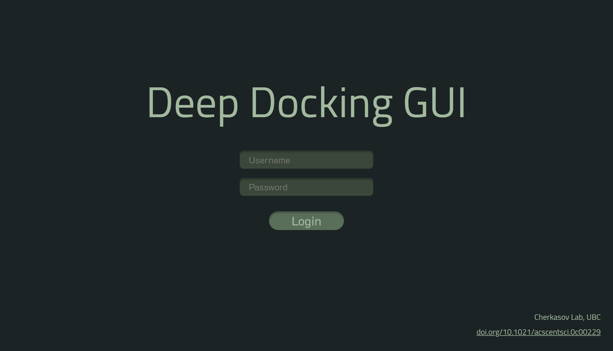
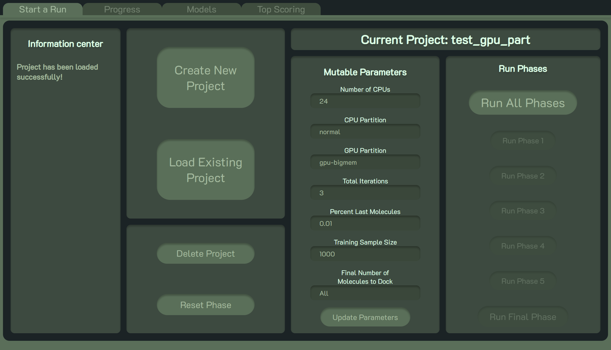
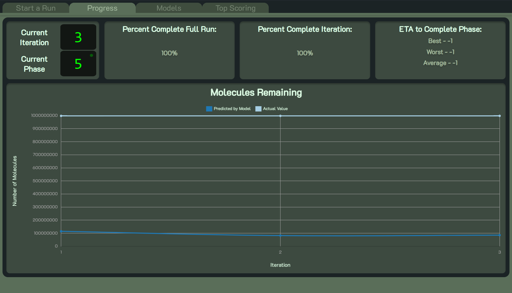
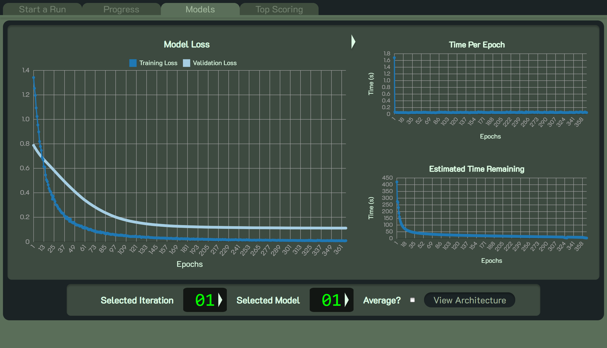
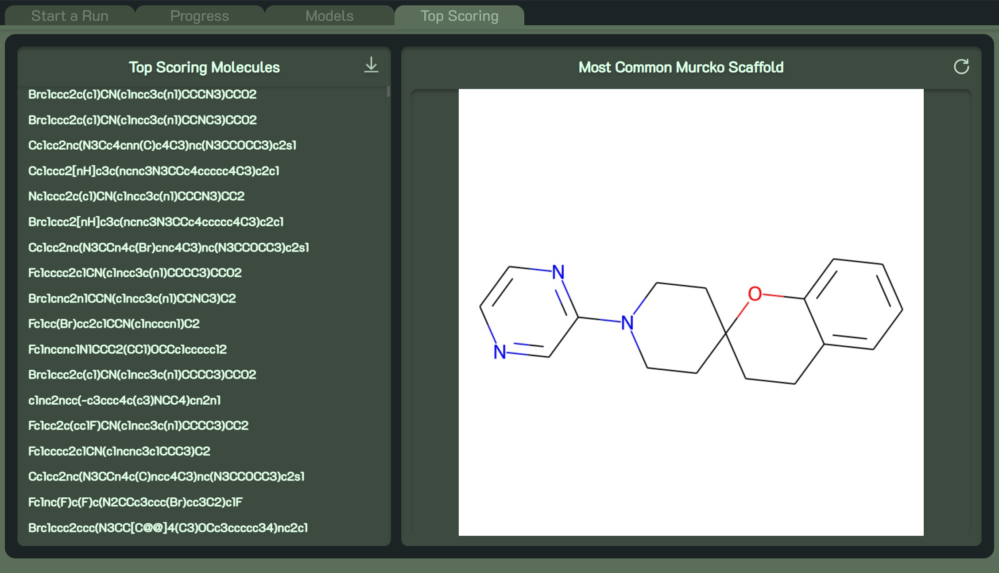
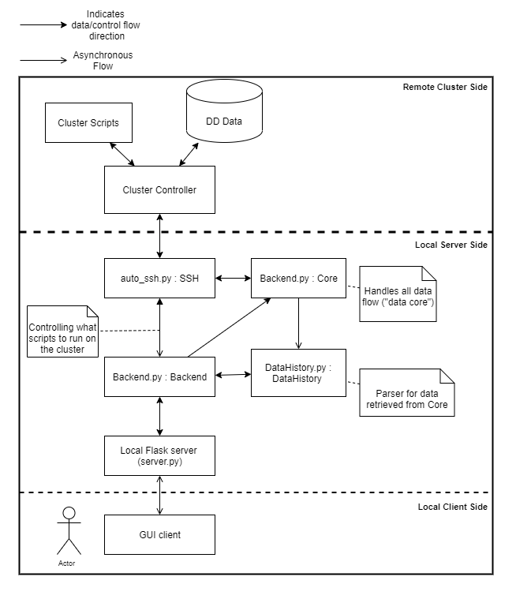

# DeepDockingGUI - v2.5.11


## What is Deep Docking?
Deep docking (DD) is a deep learning-based tool developed to accelerate docking-based virtual screening. Using NVIDIA's own Autodock-GPU,  one can screen extensive chemical libraries like ZINC15 (containing > 1.3 billion molecules) 50 times faster than typical docking. For further details into the processes behind DD, please refer to our paper (https://doi.org/10.1021/acscentsci.0c00229). 

## Prerequisites
#### Remote Computer (cloud, cluster, ...):
* Autodock GPU installed
* Slurm workload manager installed.
* A program to create 3D conformations from SMILES
* Anaconda/Conda
  * Anaconda must be configured to allow for environment activation/deactivation using bash scripting.

#### Local Computer (laptop, desktop, ...)
* Node.js (https://nodejs.org/en/download/)
* Anaconda/Conda
* Python version >= 3

## Installation
To get started, clone or download the Deep-Docking repository to your local computer. Once downloaded, navigate to the `installation` directory and run the appropriate install for your OS.

For mac and linux users run:
```bash 
bash install-linux.sh
```
or
```bash
source install-linux.sh
```

And for windows users run:
```dos 
install-windows
```
The installer will set up a local Conda environment and all the *Node.js* modules needed to run the local server. Then will request access to the SLURM cluster where it will install all the scripts needed to run Deep Docking projects and set up another Conda environment to run them.

# Getting started
## Starting up the GUI
After installation, a new Conda environment on your local device called *DeepDockingLocal* should now be available. To start up the GUI, activate the *DeepDockingLocal* environment then navigate to `Deep-Docking/GUI` and run the appropriate command to start up the server.

For mac and linux:
```bash 
npm run start-lin
```
For windows:
```bash 
npm run start-win
```

After running the above, you should see something similar to the following: 
```bash 
> dd_gui@2.0.0 start-win
> conda activate DeepDockingLocal && set FLASK_APP=server.py && set FLASK_ENV=local_host && flask run

 * Serving Flask app "server.py "
 * Environment: local_host 
 * Debug mode: off

Open Website On Default Browser? 
Enter y to launch or any other key to open manually:
 ```
Answer the prompt with `y` for it to automatically open the GUI in a default browser. Or just press enter and you will be prompted with this link which you can open up in a browser of your choice.
```bash
Enter the provided link into your browser.
 * Running on http://127.0.0.1:5000/ (Press CTRL+C to quit)
```

## Logging in
<p align="center">
  
  <p align="center">
    <b>Figure 1:</b> The login screen that the user will first encounter.
  </p>
</p>


Logging in is an important step in order for the server to set up an SSH connection with the cluster. To log in, just use the same username and password as in the installation step to connect to the cluster.

## Creating/ loading a project
<p align="center">
  
  <p align="center">
    <b>Figure 2:</b> The Start a Run tab when a project is loaded up.
  </p>
</p>

If this is 


## Progress
<p align="center">
  
</p>


## Models
<p align="center">
  
</p>


## Top Scoring
<p align="center">
  
</p>


## Where to get final top hits:
This should be located on the cluster in the folder for the last iteration of the project under the name `smiles.csv` (contains the smiles with their corresponding IDs).
The Top Scoring tab allows you to download the top 1000 hits of that smiles file from the GUI directly. 

## Architecture
<p align="center">
  
</p>

**Figure 1:** Dependency diagram illustrating the main components of the Deep Docking GUI. The user interacts with the GUI through the GUI client (a browser) which communicates with the locally hosted server via HTTP. The server utilizes the Backend object to create an SSH connection with the cluster and send and receive information from it. It then can serve information to the GUI client or send scripts and commands to run on the cluster.

## Common Issues + Fixes:
```python
  File "[...]/site-packages/tensorflow/python/keras/saving/hdf5_format.py", line 210, in load_model_from_hdf5
    model_config = json.loads(model_config.decode('utf-8'))
AttributeError: 'str' Object has no attribute 'decode'
```
  >This error is followed by an `IndexError` on line 264 of `get_model_image` and is most likely a dependancy issue with keras, make sure you have version 2.10.0 of `h5py` (versions 3.0+ cause issues) installed on the cluster side in the `DeepDockingRemote` conda environment. You can check the version by first activating the conda environment and then typing `pip show h5py`.<br>
  >You can install/downgrade it using pip: `pip install h5py==2.10.0` 

```bash
> dd_gui@2.0.0 start-lin /path/to/Deep-Docking/GUI
> export FLASK_APP=server.py && export FLASK_ENV=local_host && flask run
 sh: flask: command not found
 npm ERR! code ELIFECYCLE
```
 > If you had recently updated the version of GUI you might get this issue. This is an issue with your browser and not the scripts. You need to refresh the cache on the page that you get this error on (see https://bit.ly/3evFrJF for how to refresh cache on your system/browser).
